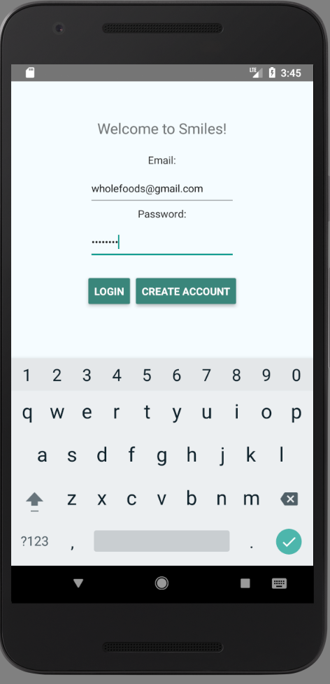
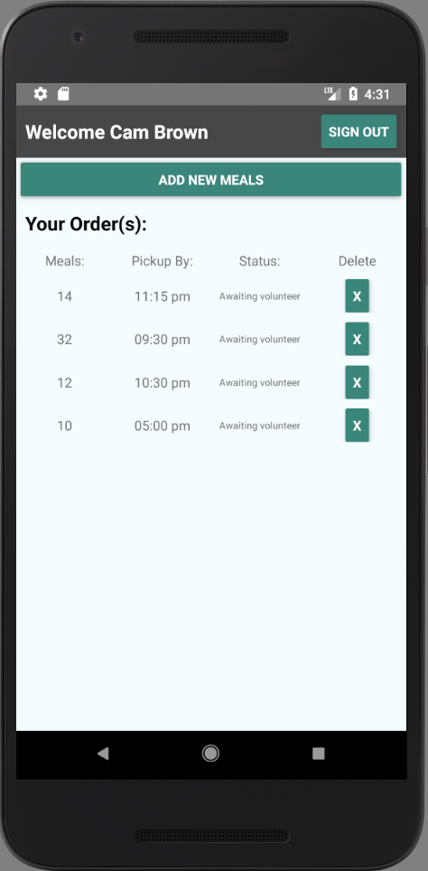
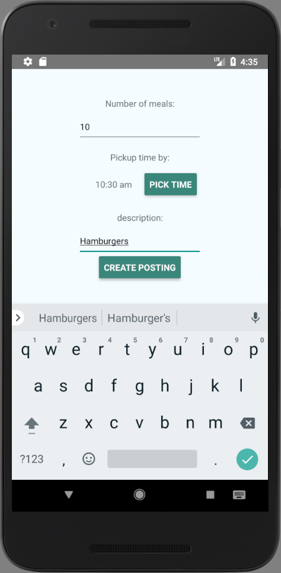
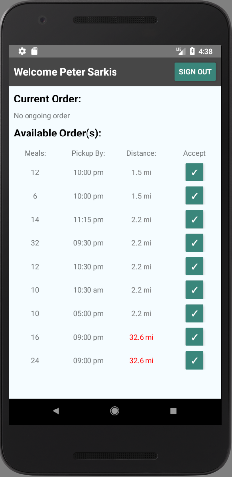
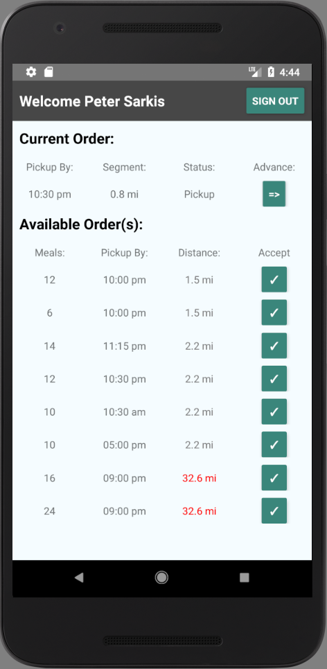
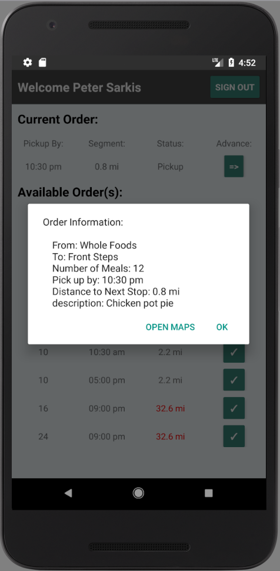
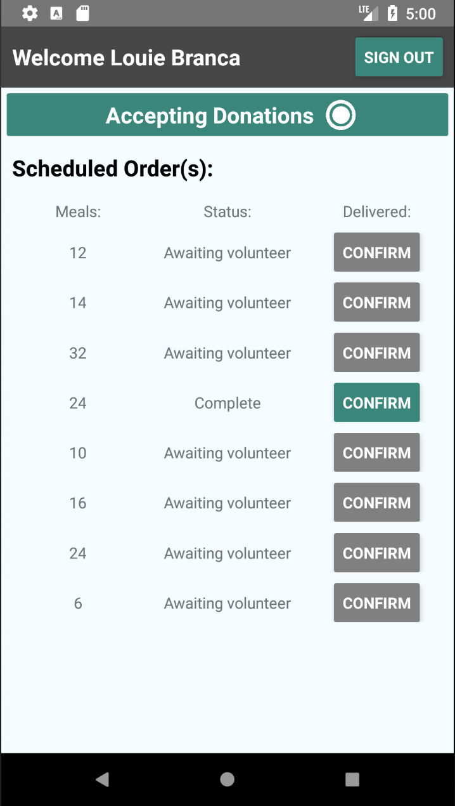

##### **Smiles is a full stack iOS and Android app that helps transport excess food to shelters in need.**

My goal was to create a mobile platform that connects Food vendors, Volunteers and Shelters together under the purpose to feed those in need.

Technologies:
* Node.JS
* React
* React Native
* Axios
* Google Maps API
* Express
* Knex
* PostgreSQL
* Heroku

### Challenges:

* This was my very first independent full stack application in addition to my first React and React Native app.

* Communication between users was a challenge because there was no direct link. Instead all the users talked to the database to gather information on the others. My solution was adding a refresh option that could allow for retrieval of updated information. An alternative solution would be to use a socket connect like Firebase to have data relayed to the user without the need of continuous api calls.

* This was my first time using the Google Maps API distance Matrix, and geocoding.

* Building page navigation without the use of a router, and incorporating the ability to keep track previously visited pages in order to allow for the back functionality.

### Scenario

Cam own a local restaurants, towards the end of the day she realize will around 10 extra meals that she cannot keep. Using Smiles Cam will post her order. Peter in the area, will see Cam's order and help transport to Louie who runs a near by shelter.

### Summary

* Cam signs into her account.

### Walkthrough:
Cam signs into her account.

Once signed in she sees her dashboard.

The Cam's dashboard will list all of their orders which can be clicked on for more detail. She will click on add new meals fills out the forum.

Next Peter will sign in, taking him to his home page, where a list of all available orders are displayed.

Peter will view the order the food vendor just created and accept it as their current order.

Peter can then click on his current order to see details about the current segment as well as get a route built with google maps.

Once Peter has arrived and picked up the meals he can advance the order to the next segment. The current order details will now be updated to take Peter to the point of destination. Once he arrives to the shelter he can advance the order again.

Finally Louie can log in and confirm their donation has arrived.

### App Demo

### Plans for the future:

* Incorporate Firebase into my technology stack so that the database can inform user about newly built orders.

* Add React Native push notification to inform food vendors when their orders get accepted, tell volunteers about orders near them, and notify shelters when they get a new order scheduled for delivery.

* Incorporate the time estimation that the google maps API offers to provide the volunteers with more information on the orders.

* Allow for multiple stop pickup delivery by volunteers.
