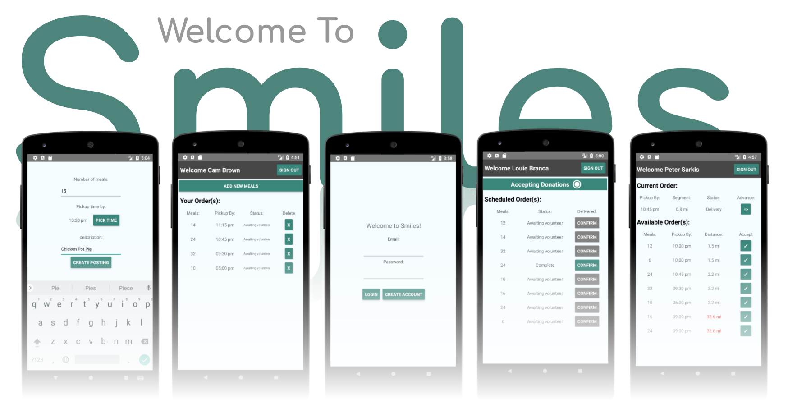

**Smiles is a full stack iOS and Android app that helps transport excess food to shelters in need.**

My goal was to create a mobile platform that connects Food vendors, Volunteers and Shelters together under the purpose to feed those in need.

Technologies:
* Node.JS
* React
* React Native
* Axios
* Google Maps API
* Express
* Knex
* PostgreSQL
* Heroku

### Challenges:

This was my very first independent full stack application in addition to my first React and React Native app.

Communication between user was a challenge because there was no direct link, instead all the users talked to the database to gather information on the others.
